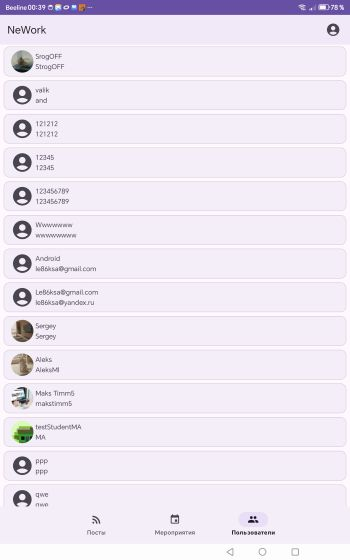
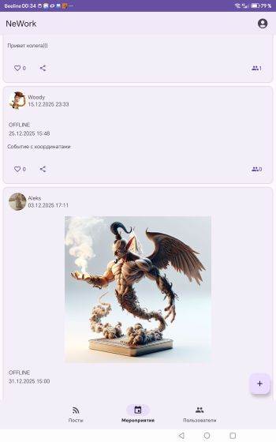

# NeWork — Социальная сеть для профессионалов

Android-приложение для обмена постами, событиями и профессиональным опытом. Дипломный проект, разработанный на Kotlin.

## 📱 Основные функции

- ✅ **Лента постов** с лайками и медиавложениями
- ✅ **Лента событий** с типом (online/offline) и участниками
- ✅ **Карта с маркерами** в детальном просмотре (Yandex MapKit)
- ✅ **Создание/редактирование** постов и событий
- ✅ **Прикрепление геопозиции** через интерактивную карту
- ✅ **Профили пользователей** с местами работы
- ✅ **Авторизация и регистрация** с загрузкой аватара

## 🛠 Технологии

- Kotlin, Coroutines, Flow
- Single Activity + Navigation Component
- Retrofit, Room, Dagger Hilt
- Yandex MapKit, Glide, ExoPlayer
- Paging 3, GitHub Actions CI/CD

## 📸 Скриншоты

<p align="center">
  
  
  
  
</p>

## 🚀 Быстрый старт

1. Клонируйте репозиторий:
```bash
git clone https://github.com/AleksandrLeksakov/NeWorkDiploma.git

создайте в корне проекта  secret.properties  по аналогии как local.properties
Добавьте ключи в secret.properties:

properties
API_KEY=ваш_ключ_сервера
MAPKIT_API_KEY=ваш_ключ_yandex_mapkit
Откройте в Android Studio и запустите

📄 Соответствие ТЗ
Требование	Статус
Single Activity архитектура	✅
Работа с API сервера	✅
Карта с маркерами	✅
Валидация форм	✅
Пагинация и кэширование	✅
Обработка медиафайлов	✅
APK для тестирования: Artifacts GitHub Actions
